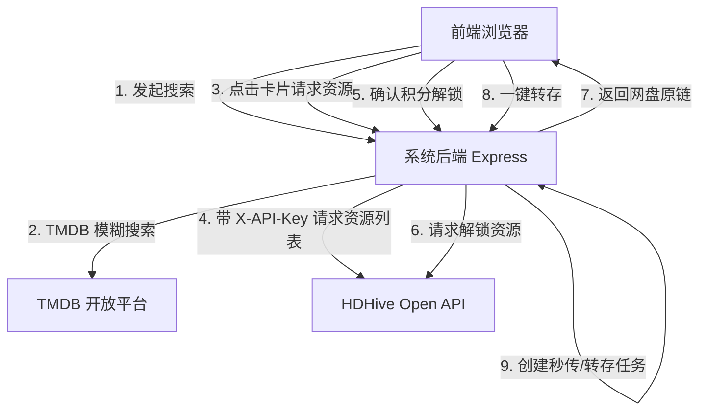

# HDHive（影巢）资源搜索与解锁集成可行性报告

本报告旨在评估与分析在天翼云盘自动转存系统中集成第三方影视资源共享平台 **HDHive（影巢）** 资源搜索、规格展示、积分解锁及自动创建转存任务的可行性，并给出具体的系统架构和实现方案。

---

## 1. 需求背景与痛点分析

天翼云盘自动转存系统当前的核心功能在于通过配置分享链接实现自动化转存和重命名，并集成了 CloudSaver 远程搜索。然而，用户在实际寻找影视资源时，往往面临以下痛点：
1. **多平台检索繁琐**：需要在各大资源站（如 HDHive）手动登录、搜索、查看是否有可用网盘（115、123、夸克、阿里等）的资源。
2. **失效链接多**：网盘链接经常失效，手动点开检查费时费力。
3. **积分扣除不透明**：部分优质资源解锁需要消耗站点积分，在第三方工具中如不做好前置展示，容易造成积分的无谓损耗。
4. **转存操作脱节**：在资源站获取到网盘链接后，仍需手动复制、返回本系统、新建任务，步骤繁复。

因此，在系统内深度集成 **HDHive** 资源搜索，打通 **“搜索 -> 网盘对比 -> 确认消耗积分解锁 -> 复制链接/直接创建转存任务”** 的全流程，将极大提升用户体验与自动化转存效率。

---

## 2. 技术可行性评估

经过对 HDHive 站点机制及现有第三方开源生态（如 `fish2018/hdhive-api` 和 MoviePilot 插件）的逆向与调研，影巢提供了基于 API Key 鉴权的开放接口（Open API）。通过系统化封装，完全可以实现无缝集成。

### 2.1 鉴权机制
影巢 API 接口采用 **API Key 校验**。
- **调用身份凭证**：用户在影巢个人中心生成的 API Key。
- **鉴权方式**：在向影巢发送的 HTTP 请求头中添加 `X-API-Key` 字段。例如：
  ```http
  X-API-Key: your_hdhive_api_key_here
  ```
- **配置持久化**：可在本系统的“系统设置”页面中增加 `HDHive API Key` 配置项，写入 SQLite 数据库的全局配置表，实现账号安全管理。

### 2.2 核心 API 接口映射
HDHive Open API 的核心路由极其规范，其主要端点如下：

| 功能描述 | HTTP 方法 | API 路径 | 请求参数 / 载荷 | 关键返回字段 |
| :--- | :--- | :--- | :--- | :--- |
| **连通性校验** | `GET` | `/api/open/ping` | 无 | `{"success": true, "message": "pong"}` |
| **查询积分/配额** | `GET` | `/api/open/quota` | 无 | 积分数（如 `points`）、今日剩余解锁配额等 |
| **按 TMDB ID 获取网盘资源** | `GET` | `/api/open/resources/:type/:tmdb_id` | `type`: movie/tv<br>`tmdb_id`: TMDB 唯一ID | 资源列表，包含：网盘类型、标题、文件大小、积分消耗、有效状态、资源唯一 ID |
| **解锁网盘链接** | `POST` | `/api/open/resources/unlock` | `{"id": "resource_id"}` | 解锁后的网盘原链（如夸克/115分享链接）、提取码等 |

### 2.3 影视数据库 (TMDB) 协同机制
HDHive 站内的资源管理与 **TMDB** 数据是强绑定的。
- **可行性优势**：本系统已经内置了成熟的 `TMDBService`（`src/services/tmdb.js`），支持中文优先搜索及双语回退机制。
- **协同逻辑**：用户在本系统发起搜索时，系统直接调用本地 `/api/tmdb/search` 从 TMDB 获取影视条目（电影/剧集、年份、海报等），并在前端渲染。点击卡片后，提取对应的 `tmdbId` 和 `mediaType`，再请求后端的 HDHive 资源接口，从而精确拉取该影片在影巢平台上的所有网盘资源，实现极高的搜索准确率。

---

## 3. 系统架构与集成方案设计

为保证系统代码的高内聚、低耦合以及界面视觉的精致感，集成方案将分为**后端接口开发**与**前端交互升级**两个部分。

### 3.1 后端架构设计 (Backend)

我们将在 `src/sdk/hdhive/` 目录下新增 SDK 模块，业务接口与路由将参照 CloudSaver 设计，保持系统架构的规整性。



#### 1. SDK 设计 (`src/sdk/hdhive/sdk.ts`)
实现 `HDHiveSDK` 单例类，处理所有与影巢 API 的直接通信：
- 读取配置服务的 `hdhive.apiKey`。
- 实现 `ping()`、`getQuota()` 进行连通性和积分校验。
- 实现 `getResources(type, tmdbId)` 请求指定媒体的网盘列表，并在 SDK 层对结果进行规范化清洗（过滤出网盘类别：115、123、夸克、百度、阿里等）。
- 实现 `unlockResource(resourceId)` 发送解锁请求。

#### 2. 路由设计 (`src/sdk/hdhive/index.ts`)
注册接口：
- `GET /api/hdhive/quota`：获取剩余积分与额度。
- `GET /api/hdhive/resources`：查询资源列表（入参 `type`, `tmdbId`）。
- `POST /api/hdhive/unlock`：解锁资源（入参 `resourceId`）。

---

### 3.2 前端交互设计 (Frontend)

遵循系统一贯的**毛玻璃、极简科技感与微动效**的设计理念，将新增一个精美的影巢搜索模态框。

#### 1. 搜索触发入口
在主界面顶部或工具栏的 CloudSaver 搜索按钮旁，新增“影巢搜索”入口按钮：
- 样式采用 HSL 调整的 Indigo 渐变配合半透明磨玻璃质感。
- 鼠标悬停时伴随 `translateY(-1px)` 及发光阴影动效。

#### 2. TMDB 搜索及影视展示
点击按钮后弹出 `HDHiveSearchModal`：
- 输入框支持回车及点击搜索图标触发，输入框带占位符 `搜索电影和剧集...`。
- 搜索结果以网格布局展示 TMDB 海报墙，附带年份、类别（电影/剧集）与 TMDB 评分胶囊。

#### 3. 网盘 Tab 资源列表展示
点击影视卡片新开详情页或右侧抽屉，根据 API 返回的资源列表，按网盘类型进行分类：
- 提供 `115网盘`、`123云盘`、`夸克网盘`、`百度网盘`、`阿里云盘` 选项卡，各选项卡使用其官方图标/色彩系统（如夸克使用科技蓝紫色、115使用蓝色一生相伴图标）。
- 列表项包含：
  - 资源标题及规格信息（如：“钢铁侠 2160p remux (2008)【55.6GB】已刮削”）。
  - 发布者头像、昵称、发布时间。
  - **状态胶囊**：
    - 积分胶囊：如 `免费`（绿色背景）或 `0 积分`、`需要 5 积分`（橙色背景）。
    - 失效状态：如正常（不显示）或 `疑似失效`（红色发光标签）。
    - 质量标签：如 `4K`、`REMUX`、`HDR`、`简中外挂`（Slate 暗灰半透明背景）。

#### 4. 积分解锁与一键转存
点击资源项，弹出解锁确认面板：
- **积分警告**：明确提醒“解锁该资源将消耗 X 积分，确定解锁吗？”，防止用户误触流失积分。
- **确定解锁按钮**：点击后发起异步请求。按钮显示 Loading 状态。
- **复制与转存面板**：解锁成功后，显示“复制链接”按钮；同时，为发挥本系统特长，额外新增 **“一键创建转存”** 按钮。点击后自动关闭搜索框，将解锁后的分享链接填充至系统的新建任务表单并自动触发解析，实现全链条闭环。

---

## 4. 关键技术细节与边界处理

为保证系统的稳定运行与用户账号安全，需在实现中注意以下细节：

1. **缓存设计**：影巢的资源列表通常在短时间内不会发生大变动，可对 `GET /api/hdhive/resources` 的响应结果在后端进行短时间内存缓存（如 5 分钟），避免用户频繁切换页面时重复请求影巢服务器，节省 API 调用开销。
2. **积分扣除熔断机制**：为防止高频点击或前端代码异常造成用户积分被瞬间扣光，后端在执行 `POST /api/hdhive/unlock` 时，应对同一 `resourceId` 的解锁操作进行防抖，并检测如果所需积分为正且用户在短时间内解锁数量异常时触发熔断。
3. **失效链接视觉降级**：API 返回中被标记为 `expired` 或 `疑似失效` 的资源，在前端列表中将文字设为灰色斜体，并添加删除线，同时将“解锁”操作置灰或加入二次强确认，提升用户体验。
4. **异常鉴权处理 (401)**：如果用户配置的 API Key 无效，影巢 API 会返回 401 状态码。SDK 应捕获该状态，在后端日志中记录，并向前端返回友好中文提示“影巢 API Key 无效或已过期，请前往系统设置重新配置”。

---

## 5. 落地实施路线图 (Milestones)

如果方案获得批准，建议按照以下阶段分步落地：

| 阶段 | 核心任务 | 预计工期 |
| :--- | :--- | :--- |
| **Phase 1: 后端开发** | 实现 `HDHiveSDK`，注册 Express API 路由，对接 Open API | 1.5 天 |
| **Phase 2: 系统设置** | 在设置页面增加影巢 API Key 的输入保存与数据库持久化逻辑 | 0.5 天 |
| **Phase 3: 前端交互** | 设计并实现搜索弹窗、TMDB 影视展示及网盘分类 Tab 列表渲染 | 2.0 天 |
| **Phase 4: 功能集成** | 串联“积分解锁 -> 原链返回 -> 复制链接与一键创建任务”的闭环逻辑 | 1.0 天 |
| **Phase 5: 联调测试** | 联调、多网盘适配测试、异常拦截（401/403/超时）与日志监控集成 | 1.0 天 |

---

## 6. 结论

综上所述，集成 HDHive（影巢）资源搜索与解锁功能在技术上**完全可行**。
系统已具备 TMDB 服务等必要的基础组件，通过引入影巢 Open API Key 鉴权方案，能以极低的网络开销和清晰的代码架构实现该功能。功能上线后将极大地拓宽系统的资源获取渠道，打通“找资源-转存”的最后一公里，具备极高的实用价值。建议立项开发。
